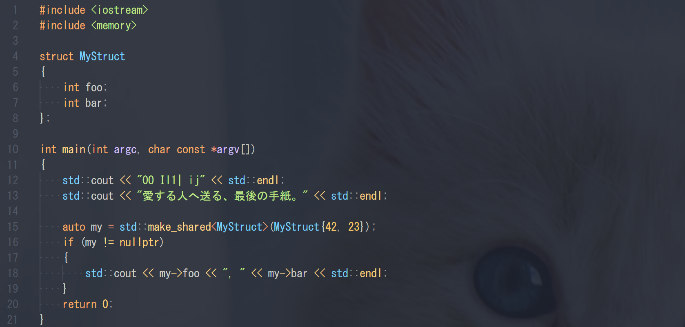

# ヴァイオレット・エヴァーガーデン

この前，映画見てきました．

[http://www.violet-evergarden.jp/sidestory/](http://www.violet-evergarden.jp/sidestory/)

手紙がテーマのストーリーです．

> とある大陸の、とある時代。
> 
> 大陸を南北に分断した大戦は終結し、世の中は平和へ向かう気運に満ちていた。
> 
> 戦時中、軍人として戦ったヴァイオレット・エヴァーガーデンは、軍を離れ大きな港町へ来ていた。
> 戦場で大切な人から別れ際に告げられた「ある言葉」を胸に抱えたまま――。
> 
> 街は人々の活気にあふれ、ガス灯が並ぶ街路にはトラムが行き交っている。
> ヴァイオレットは、この街で「手紙を代筆する仕事」に出会う。
> それは、依頼人の想いを汲み取って言葉にする仕事。
> 
> 彼女は依頼人とまっすぐに向き合い、相手の心の奥底にある素直な気持ちにふれる。
> そして、ヴァイオレットは手紙を書くたびに、あの日告げられた言葉の意味に近づいていく。

**我々の仕事も毎日文字を読み書きする仕事です．だからフォントにもこだわりたい．**

# プログラミングにおすすめのフォント

* 等幅フォント（個人的には半角と全角は1:2でなくてもいい）
* `0`と`O`や`I`と`l`と`1`等の可読性がいいフォント．
* プログラミングに特化した合字対応のフォントも．

## 参考にMS ゴシック

* 一応等幅フォントです．Visual Studioだと（たぶん）いまだにデフォルト．
* `0`と`O`や`I`と`l`と`1`の可読性は悪いです．
* 他のフォントと比べるとやっぱり見づらいです．

## Consolas

* Microsoft製のプログラミング向けフォントです．Windows 10には標準で入っています．（と思います）
* 半角文字のみです．（日本語は別フォント）
* GitHubでも使われています．
* 7，8年くらい愛用してました．

[https://www.fontpalace.com/font-download/Consolas/](https://www.fontpalace.com/font-download/Consolas/)

## Ricty Diminished

* 人気のフォントです．（Rictyの姉妹フォント．日本語はこちらが見やすい気がする．）
* InconsolataとCircle M+ 1m（日本語）を組み合わせたフォントです．
* 半角と全角がきれいに1:2で表示されます．

[https://github.com/edihbrandon/RictyDiminished](https://github.com/edihbrandon/RictyDiminished)

## Myrica

* Rictyとよく似たフォントです．（半角英数字はInconsolata）
* Inconsolataと源真ゴシック/Mgen+（日本語）を組み合わせたフォントです．
* 半角と全角がきれいに1:2で表示されます．
* 名前がかわいい

[https://github.com/tomokuni/Myrica](https://github.com/tomokuni/Myrica)

## HackGen（白源）

* Rictyにインスパイアされて作られたフォントです．（少し前にQiitaにあがってました．）
* Hackと源柔ゴシック（日本語）を組み合わせたフォントです．
* 半角と全角がきれいに1:2で表示されます．また半角と全角が3:5版もあります．（半角文字が少し大きめに表示される）

[https://github.com/yuru7/HackGen](https://github.com/yuru7/HackGen)

## Source Han Code JP

* Adobe社が開発した，日本語も奇麗に表示できるフォントです．
* Source Code Proと源ノ角ゴシック（日本語）を組み合わせたフォントです．
* 半角と全角が2:3で表示されます．
* 今日紹介するフォントの中で，一番大きく，視認性がいいです．

[https://github.com/adobe-fonts/source-han-code-jp](https://github.com/adobe-fonts/source-han-code-jp)

## Cascadia Code

* 最近発表されたMicrosoft製のプログラミング用フォントです．
* 半角文字のみです．（日本語は別フォント）
* 合字に対応しています．  

* 今後しばらく使っていく予定です．

[https://github.com/microsoft/cascadia-code](https://github.com/microsoft/cascadia-code)

## S2Gらぶ

* かわいいです
* かわいいです
* かわいいです

[http://s2g.jp/font/index.htm](http://s2g.jp/font/index.htm)

# まとめ

* MSゴシック使ってる人はとりあえずConsolasを試してみてください．
* 半角と全角を1:2で表示したい場合はRicty Diminishedがおすすめです．細く感じるならHackGenを試してください．
* HackGenは1:2の他に3:5版のHackGen35もバランスがよくおすすめです．
* とにかく視認性がいいフォントが好みならSource Han Code JPがおすすめです．
* ぼくは新しく出たCascadia Codeを使ってます．合字楽しい．
* S2Gらぶ，かわいい！
* ヴァイオレット・エヴァーガーデン見てください！！
